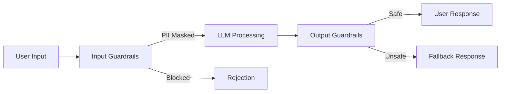
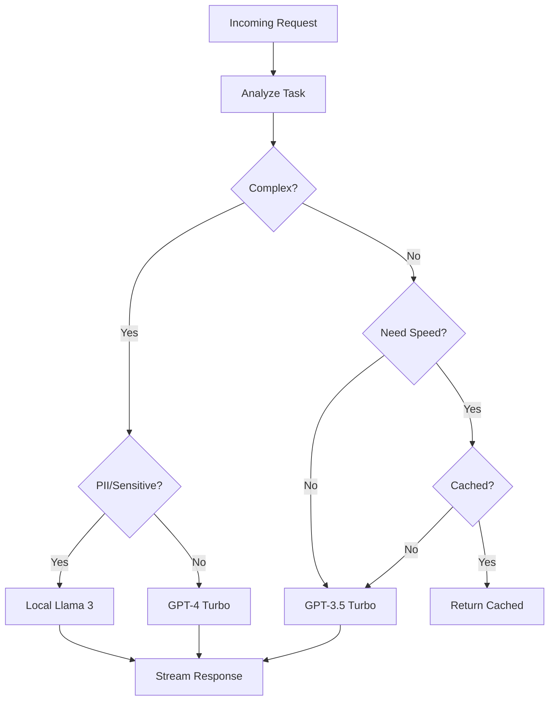
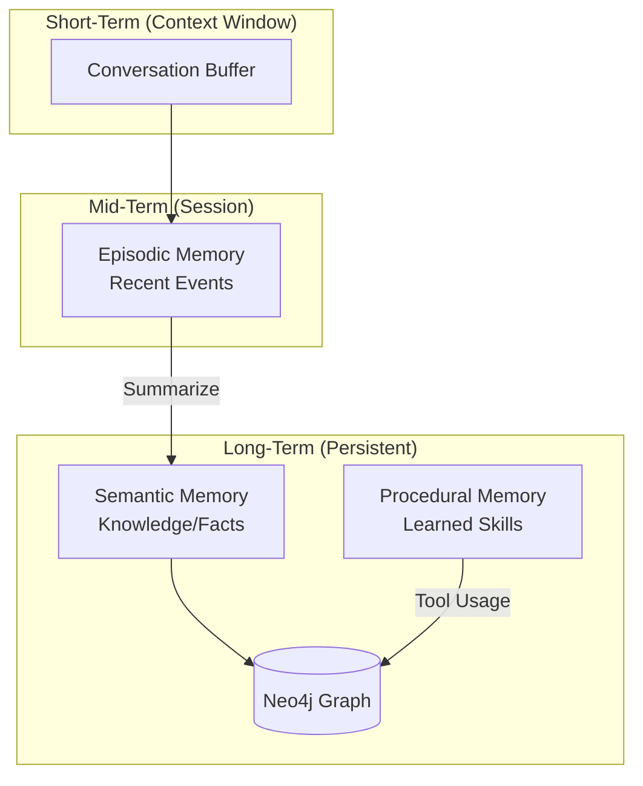
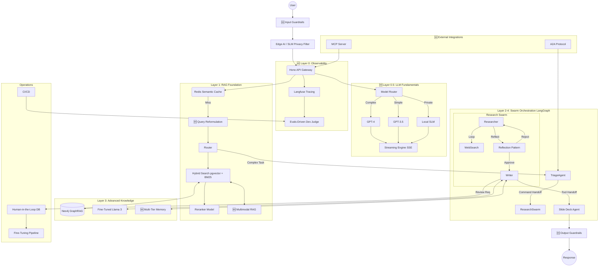

# InsightOS: Strategic Market Intelligence Platform - Enhanced Architecture Plan

A comprehensive plan review and enhancement for building a production-grade AI platform incorporating all 2025/2026 AI engineering skills.

---

## Executive Summary

Your original plan is **excellent and well-structured**. After researching the latest 2025/2026 AI trends, I've identified **missing components** and **corrections** to make InsightOS truly enterprise-ready.

> [!IMPORTANT]
> This document enhances your original plan with missing critical components. Items marked with 🆕 are **additions** and items marked with ⚠️ are **corrections/improvements**.

---

## 1. Tech Stack Review

### ✅ Confirmed (Your Original Choices)

| Component     | Choice                           | Status       |
| ------------- | -------------------------------- | ------------ |
| Monorepo      | TurboRepo / pnpm workspaces      | ✅ Excellent |
| Runtime       | Node.js v22 + Cloudflare Workers | ✅ Excellent |
| Framework     | Hono (API) + Next.js (Frontend)  | ✅ Excellent |
| Orchestration | LangGraph.js                     | ✅ Excellent |
| Vector DB     | PostgreSQL + pgvector            | ✅ Good      |
| Graph DB      | Neo4j                            | ✅ Excellent |
| Cache/Queue   | Redis + BullMQ                   | ✅ Excellent |
| Fine-tuning   | Unsloth                          | ✅ Good      |

### 🆕 Missing Additions

| Component         | Recommendation                                         | Rationale                                                                                        |
| ----------------- | ------------------------------------------------------ | ------------------------------------------------------------------------------------------------ |
| **Observability** | **Langfuse** (open-source) as alternative to LangSmith | Self-hostable, free, better for privacy. LangSmith requires enterprise license for self-hosting. |
| **Guardrails**    | **Portkey** or **NeMo Guardrails**                     | Critical for production: input validation, PII detection, output filtering                       |
| **Memory Layer**  | **Mem0** or custom implementation                      | Long-term episodic + semantic memory beyond conversation context                                 |
| **MCP Server**    | Custom MCP implementation                              | Model Context Protocol for agent-to-data source connections                                      |
| **A2A Protocol**  | Google Agent-to-Agent                                  | Future-proofing for inter-agent communication standards                                          |

### ⚠️ Corrections

1. **LangSmith** → Consider **Langfuse** as primary choice (open-source, self-hostable, free)
2. **Unsloth** → Note it's **Python-only**, you'll need a Python microservice for fine-tuning jobs

---

## 2. Feature Implementation Roadmap - Enhanced

### Layer 0: Infrastructure & Guardrails 🆕

**Feature:** "Platform Security & Compliance Layer"

**Techniques (MISSING from original plan):**

| #       | Technique                         | Description                                          | Implementation                                                              |
| ------- | --------------------------------- | ---------------------------------------------------- | --------------------------------------------------------------------------- |
| **0.1** | **Input Guardrails**              | Validate/sanitize all user inputs before hitting LLM | Prompt injection detection, PII redaction, format validation                |
| **0.2** | **Output Guardrails**             | Filter LLM responses for safety                      | Toxic content filtering, sensitive data leak prevention, format enforcement |
| **0.3** | **PII Detection/Masking**         | Redact personal information                          | Run before sending to cloud LLMs, restore in final output                   |
| **0.4** | **Rate Limiting & Cost Controls** | Prevent runaway costs                                | Token budgets per user/request, circuit breakers                            |



---

### Layer 0.5: LLM Fundamentals (Foundation) 🆕

**Feature:** "Core LLM Operations & Best Practices"

**Techniques (MISSING from original plan - Stage 1 of 6-Stage Curriculum):**

| #            | Technique                        | Description                          | Implementation                                                              |
| ------------ | -------------------------------- | ------------------------------------ | --------------------------------------------------------------------------- |
| **0.5.1**    | **Prompt Engineering Patterns**  | Systematic prompt design strategies  | Few-shot examples, Chain-of-Thought, system messages, prompt templates      |
| **0.5.2**    | **Model Router**                 | Dynamic model selection by task      | Route complex tasks to GPT-4, simple to GPT-3.5, privacy-sensitive to local |
| **0.5.3**    | **Streaming Responses**          | Real-time token-by-token delivery    | Server-Sent Events (SSE), partial JSON streaming, progress indicators       |
| **0.5.4**    | **Parameter Tuning**             | Model configuration best practices   | Temperature, top-p, max tokens, frequency penalty guidelines                |
| **0.5.5** 🆕 | **Prompt Versioning**            | Track and A/B test prompt variations | Git-tracked prompts, performance metrics per version                        |
| **0.5.6** 🆕 | **JSON Mode & Function Calling** | Structured output enforcement        | OpenAI JSON mode, tool/function definitions, schema validation              |

**Model Selection Matrix:**



**Prompt Engineering Framework:**

```typescript
// Example: Structured Prompt Template
interface PromptTemplate {
  system: string; // Role and constraints
  fewShot: Example[]; // 2-5 examples for few-shot learning
  task: string; // Actual user request
  format: string; // Output format instructions
  chainOfThought?: boolean; // Enable CoT reasoning
}

// Example: Chain-of-Thought for complex analysis
const researchPrompt: PromptTemplate = {
  system: 'You are a strategic market analyst. Think step-by-step.',
  fewShot: [
    {
      input: 'Analyze Tesla',
      output: 'Let me break this down:\n1. Market position...\n2. Competitors...',
    },
  ],
  task: '{{user_query}}',
  format: 'Return JSON: { reasoning: string[], conclusion: string }',
  chainOfThought: true,
};
```

**Streaming Implementation:**

```typescript
// Server-Sent Events (SSE) for real-time responses
app.post('/chat/stream', async (c) => {
  const stream = await openai.chat.completions.create({
    model: 'gpt-4-turbo',
    messages: [...],
    stream: true,  // Enable streaming
  });

  return streamSSE(c, async (stream) => {
    for await (const chunk of stream) {
      const token = chunk.choices[0]?.delta?.content || '';
      await stream.writeSSE({ data: token });
    }
  });
});
```

---

### Layer 1: The Foundation (Reliable RAG) ✅ Enhanced

Your original techniques are correct. **Additions:**

| #          | Technique                     | Status     | Enhancement                                                         |
| ---------- | ----------------------------- | ---------- | ------------------------------------------------------------------- |
| 1          | Hybrid Search (BM25 + Vector) | ✅ Correct | —                                                                   |
| 2          | Reranker (Cohere/BGE)         | ✅ Correct | —                                                                   |
| 3          | Semantic Caching              | ✅ Correct | —                                                                   |
| 4          | Structured Output (Zod)       | ✅ Correct | —                                                                   |
| **1.5** 🆕 | **Contextual Retrieval**      | MISSING    | Add document metadata (dates, source, version) during chunking      |
| **1.6** 🆕 | **Query Reformulation**       | MISSING    | History-aware query rewriting for follow-up questions               |
| **1.7** 🆕 | **Multimodal RAG**            | MISSING    | Process PDFs with images, charts → use vision models for extraction |

---

### Layer 2: The Agentic Workflow (Reasoning) ✅ Enhanced

Your original techniques are correct. **Additions:**

| #          | Technique                           | Status     | Enhancement                                                  |
| ---------- | ----------------------------------- | ---------- | ------------------------------------------------------------ |
| 5          | Cyclic Graph (Plan → Act → Reflect) | ✅ Correct | —                                                            |
| 6          | Reflection Pattern (System 2)       | ✅ Correct | —                                                            |
| 7          | Human-in-the-Loop                   | ✅ Correct | —                                                            |
| **2.1** 🆕 | **Agentic RAG**                     | MISSING    | Agent decides WHEN to retrieve, can iterate queries          |
| **2.2** 🆕 | **Self-Healing Workflows**          | MISSING    | Automatic retry with modified approach on failures           |
| **2.3** 🆕 | **Command Object Handoffs**         | MISSING    | Use LangGraph `Command` object for structured agent handoffs |

---

### Layer 3: Advanced Intelligence (Context & Behavior) ✅ Enhanced

Your original techniques are correct. **Additions:**

| #          | Technique                       | Status     | Enhancement                                                |
| ---------- | ------------------------------- | ---------- | ---------------------------------------------------------- |
| 8          | GraphRAG (Neo4j)                | ✅ Correct | —                                                          |
| 9          | Fine-Tuning Pipeline            | ✅ Correct | —                                                          |
| 10         | DSPy (Programmatic Prompting)   | ✅ Correct | —                                                          |
| **3.1** 🆕 | **Multi-Tiered Memory**         | MISSING    | Episodic (events) + Semantic (facts) + Procedural (skills) |
| **3.2** 🆕 | **Memory Summarization**        | MISSING    | Compress old memories, keep recent detailed                |
| **3.3** 🆕 | **LLM Knowledge Graph Builder** | MISSING    | Auto-extract entities from unstructured docs → Neo4j       |

**Memory Architecture 🆕:**



---

### Layer 4: The Swarm & Scale ✅ Enhanced

Your original techniques are correct. **Additions/Corrections:**

| #          | Technique                        | Status     | Enhancement                                                             |
| ---------- | -------------------------------- | ---------- | ----------------------------------------------------------------------- |
| 11         | Swarm Architecture               | ✅ Correct | —                                                                       |
| 12         | Edge AI with SLMs                | ✅ Correct | —                                                                       |
| 13         | Agent Discovery                  | ✅ Correct | —                                                                       |
| 14         | Evals-Driven Development         | ✅ Correct | —                                                                       |
| **4.1** 🆕 | **MCP (Model Context Protocol)** | MISSING    | Standardized agent ↔ data source connections                            |
| **4.2** 🆕 | **A2A Protocol**                 | MISSING    | Google's Agent-to-Agent protocol for cross-platform agent communication |
| **4.3** 🆕 | **Tool-Based Handoffs**          | MISSING    | Agents transfer control via specialized handoff tools                   |
| **4.4** 🆕 | **Dynamic Agent Routing**        | MISSING    | Content-based routing vs rigid workflow                                 |

---

## 3. Missing Critical Feature: Observability & Guardrails 🆕

This is a **major gap** in the original plan. Production AI systems MUST have:

### Observability Stack

```
┌─────────────────────────────────────────────────────────────┐
│                     OBSERVABILITY LAYER                      │
├─────────────────┬─────────────────┬─────────────────────────┤
│   Tracing       │   Metrics       │   Evaluation            │
│   (Langfuse)    │   (Langfuse)    │   (DeepEval/DSPy)       │
├─────────────────┼─────────────────┼─────────────────────────┤
│ • Prompt logs   │ • Token usage   │ • Automated scoring     │
│ • LLM calls     │ • Latency P50/99│ • Hallucination checks  │
│ • Tool calls    │ • Cost tracking │ • Relevance metrics     │
│ • Agent steps   │ • Cache hits    │ • Human feedback loop   │
└─────────────────┴─────────────────┴─────────────────────────┘
```

### Recommended: Langfuse over LangSmith

| Feature           | LangSmith          | Langfuse         |
| ----------------- | ------------------ | ---------------- |
| Open Source       | ❌ No              | ✅ Yes           |
| Self-Hosting      | 💰 Enterprise only | ✅ Free          |
| Framework Support | LangChain-focused  | Multi-framework  |
| Cost              | Per-trace pricing  | Free self-hosted |

---

## 4. Updated Architecture Diagram

Your original diagram is good. Here's an enhanced version with the missing components:



---

## 5. Updated Monorepo Structure

```text
/insight-os-monorepo
├── /apps
│   ├── /web-dashboard         # Next.js (UI + Edge AI/SLM via WebLLM)
│   ├── /api-server            # Hono (API Gateway + RAG Logic)
│   └── /agent-worker          # Node.js (LangGraph Swarm + BullMQ)
│
├── /packages
│   ├── /db-schema             # Drizzle (Postgres) + Neo4j Drivers
│   ├── /ai-engine             # LangGraph definitions (Swarm/Handoffs)
│   ├── /llm-core              # 🆕 Prompt templates, model router, streaming utils
│   ├── /evals                 # DSPy scripts + DeepEval test suites
│   ├── /mcp-server            # 🆕 Model Context Protocol Server
│   ├── /guardrails            # 🆕 Input/Output validation logic
│   └── /memory                # 🆕 Multi-tier memory management
│
├── /infrastructure
│   ├── /fine-tuning           # Python scripts for Unsloth/LoRA
│   ├── /vector-store          # Docker for PGVector + Redis
│   └── /observability         # 🆕 Langfuse docker-compose + config
│
└── pnpm-workspace.yaml
```

---

## 6. Complete Technique Checklist

Here's the full list of all **28 techniques** (original 14 + 14 new):

### Foundation (Layer 0-1)

**Layer 0: Security & Operations**

- [ ] 0.1 Input Guardrails 🆕
- [ ] 0.2 Output Guardrails 🆕
- [ ] 0.3 PII Detection/Masking 🆕
- [ ] 0.4 Rate Limiting & Cost Controls 🆕

**Layer 0.5: LLM Fundamentals** 🆕

- [ ] 0.5.1 Prompt Engineering Patterns 🆕
- [ ] 0.5.2 Model Router 🆕
- [ ] 0.5.3 Streaming Responses 🆕
- [ ] 0.5.4 Parameter Tuning 🆕
- [ ] 0.5.5 Prompt Versioning 🆕
- [ ] 0.5.6 JSON Mode & Function Calling 🆕

**Layer 1: RAG Foundation**

- [ ] 1. Hybrid Search (BM25 + Vector)
- [ ] 1.5 Contextual Retrieval 🆕
- [ ] 1.6 Query Reformulation 🆕
- [ ] 1.7 Multimodal RAG 🆕
- [ ] 2. Reranker
- [ ] 3. Semantic Caching
- [ ] 4. Structured Output

### Agentic (Layer 2)

- [ ] 5. Cyclic Graph Workflow
- [ ] 2.1 Agentic RAG 🆕
- [ ] 2.2 Self-Healing Workflows 🆕
- [ ] 6. Reflection Pattern
- [ ] 7. Human-in-the-Loop

### Intelligence (Layer 3)

- [ ] 8. GraphRAG
- [ ] 3.1 Multi-Tiered Memory 🆕
- [ ] 9. Fine-Tuning Pipeline
- [ ] 10. DSPy Programmatic Prompting

### Scale (Layer 4)

- [ ] 11. Swarm Architecture
- [ ] 4.1 MCP Protocol 🆕
- [ ] 12. Edge AI with SLMs
- [ ] 13. Agent Discovery
- [ ] 14. Evals-Driven Development

---

---

## 7. Learning Methodology Mapping 🆕

Aligning InsightOS development with the **4-Level Learning Approach**:

| Level                      | Curriculum Goal                   | InsightOS Implementation                                                  |
| -------------------------- | --------------------------------- | ------------------------------------------------------------------------- |
| **Level 1: Overview**      | Slide-based architecture overview | This implementation plan + Mermaid diagrams serve as the "slide deck"     |
| **Level 2: Deep Dive**     | Detailed markdown documentation   | Each Layer section provides theory + implementation notes                 |
| **Level 3: Run Code**      | Interactive demos per stage       | Build demo features per layer (see Demo Plan below)                       |
| **Level 4: Code Analysis** | "Behind the Scenes" comments      | Add inline comments explaining: prompt design, model choices, agent logic |

### Demo Plan (Level 3 Implementation)

**Layer 0.5 Demo:** "Prompt Playground"

- UI to test different prompt templates
- A/B compare model outputs (GPT-4 vs GPT-3.5 vs Local)
- Visualize streaming responses in real-time

**Layer 1 Demo:** "Smart Search"

- Upload a document, search with hybrid retrieval
- Show BM25 vs Vector vs Hybrid results side-by-side
- Display reranking scores

**Layer 2 Demo:** "Research Agent"

- Input a company name, watch agent plan → search → reflect → summarize
- Show LangGraph execution trace in UI
- Enable human approval for risky actions

**Layer 3 Demo:** "Knowledge Graph Explorer"

- Visualize Neo4j relationships extracted from documents
- Query using natural language → GraphRAG retrieval
- Compare standard RAG vs GraphRAG results

**Layer 4 Demo:** "Agent Swarm Orchestration"

- Multi-agent collaboration on complex task (e.g., competitive analysis)
- Show agent handoffs and tool calls in real-time
- Display cost/token usage per agent

---

## 8. Key Recommendations Summary

> [!TIP] > **Priority Order for Implementation:**
>
> 1. Start with **Layer 0 (Guardrails)** - without this, you can't go to production
> 2. Build **Layer 1 (RAG)** with query reformulation from day 1
> 3. Add **Langfuse** observability early - debugging agents is hard without it
> 4. The rest follows your original layer progression

> [!WARNING] > **Critical Gaps in Original Plan:**
>
> 1. No guardrails system → Major security/compliance risk
> 2. No observability beyond LangSmith → Consider open-source Langfuse
> 3. No memory architecture → Agents forget between sessions
> 4. No MCP integration → Limits tool/data source flexibility

---

## 9. 6-Stage Curriculum Coverage ✅

Confirming **100% coverage** of the AI engineering curriculum:

| Stage                         | Topics                                 | InsightOS Coverage                                              |
| ----------------------------- | -------------------------------------- | --------------------------------------------------------------- |
| **Stage 1: LLM Fundamentals** | Prompts, JSON, Streaming, Model basics | ✅ **Layer 0.5** (Techniques 0.5.1-0.5.6)                       |
| **Stage 2: RAG**              | Embeddings, Vectors, Chunking          | ✅ **Layer 1** (Hybrid Search, Reranking, Contextual Retrieval) |
| **Stage 3: Orchestration**    | Memory, Chains, Routing                | ✅ **Layer 2-3** (LangGraph, Multi-Tier Memory, Agent Routing)  |
| **Stage 4: Agents**           | Tool Calling, ReAct                    | ✅ **Layer 2** (Reflection, Human-in-Loop, Swarm Architecture)  |
| **Stage 5: Production**       | Evals, Observability, Cost, Security   | ✅ **Layer 0 + 4** (Guardrails, Langfuse, Rate Limiting, Evals) |
| **Stage 6: Advanced**         | Multi-modal, Fine-tuning, Local LLMs   | ✅ **Layer 3** (Multimodal RAG, Unsloth, Edge AI SLMs)          |

**Project Ideas Integration:**

- ✅ Personal Knowledge Base → Core RAG + GraphRAG features
- ✅ Product Assistant → Swarm agents + Fine-tuned models
- ✅ Meeting Notes → Multimodal RAG + Structured Output
- ⚠️ Study Coach → Add quiz generation to Layer 1 (technique 1.8) 🆕

---

## 10. Verification Plan

Since this is a planning document (no code yet), verification will be:

### User Review

- Review this enhanced architecture plan
- Confirm the additions align with your vision
- Identify any domain-specific requirements I may have missed
- Decide on observability tool choice (LangSmith vs Langfuse)

### Next Steps After Approval

1. Initialize the monorepo structure with all packages
2. Set up Docker infrastructure (Postgres, Neo4j, Redis, Langfuse)
3. Build Layer 0 (Guardrails) first
4. Proceed through layers in order

---

## 11. Questions for You

1. **Observability Choice:** Do you prefer **LangSmith** (better LangChain integration, paid) or **Langfuse** (open-source, self-hostable, free)?

2. **Memory Backend:** For the multi-tier memory system, do you want to use **Mem0** (third-party) or build a **custom solution** with Redis + Postgres?

3. **Guardrails Provider:** Do you prefer **NeMo Guardrails** (NVIDIA, open-source) or **Portkey** (managed service with more features)?

4. **Fine-tuning Runtime:** Since Unsloth is Python-only, are you okay with a separate Python microservice for fine-tuning jobs, or would you prefer a fully Node.js solution with different tooling?
