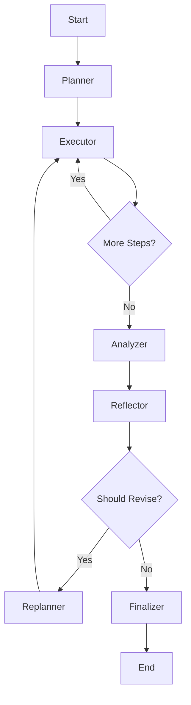

# Phase 9: Agent Workflows - Cycles & Reflection

> **Goal:** Build sophisticated agent workflows with LangGraph state machines, cyclic Plan→Act→Reflect patterns, and self-improving reasoning.

---

## Prerequisites

- Phase 8 completed (basic agents with tools)
- Understanding of state machines

---

## Tech Stack Focus

| Concept              | Purpose                      |
| -------------------- | ---------------------------- |
| LangGraph StateGraph | Define agent workflow graphs |
| Conditional edges    | Route based on state         |
| Reflection pattern   | Self-critique and improve    |
| Checkpointing        | State persistence            |

---

## Directory Structure (Changes)

```
/insight-os-monorepo
├── packages/
│   └── ai-engine/
│       └── src/
│           ├── graphs/
│           │   ├── index.ts
│           │   ├── research-graph.ts    # NEW: Research workflow
│           │   └── analysis-graph.ts    # NEW: Analysis workflow
│           └── nodes/
│               ├── index.ts
│               ├── planner.ts           # NEW: Planning node
│               ├── executor.ts          # NEW: Execution node
│               └── reflector.ts         # NEW: Reflection node
```

---

## Implementation Steps

### Step 1: Define State Schema

**1.1 Create `packages/ai-engine/src/graphs/state.ts`:**

```typescript
import { Annotation, messagesStateReducer } from '@langchain/langgraph';
import type { BaseMessage } from '@langchain/core/messages';

/**
 * Research workflow state
 */
export const ResearchState = Annotation.Root({
  // Input
  query: Annotation<string>(),

  // Messages for conversation tracking
  messages: Annotation<BaseMessage[]>({
    reducer: messagesStateReducer,
    default: () => [],
  }),

  // Planning
  plan: Annotation<string[]>({
    default: () => [],
  }),
  currentStep: Annotation<number>({
    default: () => 0,
  }),

  // Execution
  searchResults: Annotation<string[]>({
    reducer: (current, update) => [...current, ...update],
    default: () => [],
  }),
  analysis: Annotation<string>({
    default: () => '',
  }),

  // Reflection
  critique: Annotation<string>({
    default: () => '',
  }),
  shouldRevise: Annotation<boolean>({
    default: () => false,
  }),
  revisionCount: Annotation<number>({
    default: () => 0,
  }),

  // Output
  finalAnswer: Annotation<string>({
    default: () => '',
  }),
  confidence: Annotation<number>({
    default: () => 0,
  }),
});

export type ResearchStateType = typeof ResearchState.State;

/**
 * Analysis workflow state
 */
export const AnalysisState = Annotation.Root({
  query: Annotation<string>(),
  subject: Annotation<string>(),
  analysisType: Annotation<'company' | 'market' | 'trend'>({
    default: () => 'company',
  }),

  // Data gathering
  gatheredData: Annotation<Record<string, unknown>[]>({
    reducer: (current, update) => [...current, ...update],
    default: () => [],
  }),

  // Analysis stages
  initialAnalysis: Annotation<string>({
    default: () => '',
  }),
  refinedAnalysis: Annotation<string>({
    default: () => '',
  }),

  // Quality control
  qualityScore: Annotation<number>({
    default: () => 0,
  }),
  issues: Annotation<string[]>({
    default: () => [],
  }),

  // Final output
  finalReport: Annotation<string>({
    default: () => '',
  }),
});

export type AnalysisStateType = typeof AnalysisState.State;
```

---

### Step 2: Create Workflow Nodes

**2.1 Create `packages/ai-engine/src/nodes/planner.ts`:**

```typescript
import { generateObject } from 'ai';
import { createOpenAI } from '@ai-sdk/openai';
import { z } from 'zod';
import type { ResearchStateType } from '../graphs/state.js';

const openai = createOpenAI({ apiKey: process.env.OPENAI_API_KEY });

const PlanSchema = z.object({
  steps: z.array(z.string()).describe('List of research steps to execute'),
  reasoning: z.string().describe('Why this plan makes sense'),
});

/**
 * Planning node - creates a research plan
 */
export async function plannerNode(state: ResearchStateType): Promise<Partial<ResearchStateType>> {
  console.log('[Planner] Creating research plan for:', state.query);

  const { object } = await generateObject({
    model: openai('gpt-4o-mini'),
    schema: PlanSchema,
    prompt: `Create a research plan for this query: "${state.query}"

Consider:
- What information needs to be gathered?
- What sources should be consulted?
- What analysis is needed?

Create 3-5 concrete steps.`,
    temperature: 0.3,
  });

  console.log('[Planner] Plan created:', object.steps);

  return {
    plan: object.steps,
    currentStep: 0,
  };
}

/**
 * Re-planning node - revises plan based on reflection
 */
export async function replannerNode(state: ResearchStateType): Promise<Partial<ResearchStateType>> {
  console.log('[Replanner] Revising plan based on critique');

  const { object } = await generateObject({
    model: openai('gpt-4o-mini'),
    schema: PlanSchema,
    prompt: `Revise this research plan based on the critique.

Original query: "${state.query}"
Original plan: ${state.plan.join(', ')}
Critique: ${state.critique}
Current analysis: ${state.analysis.slice(0, 500)}

Create an improved plan that addresses the critique.`,
    temperature: 0.3,
  });

  return {
    plan: object.steps,
    currentStep: 0,
    revisionCount: state.revisionCount + 1,
  };
}
```

**2.2 Create `packages/ai-engine/src/nodes/executor.ts`:**

```typescript
import { generateText } from 'ai';
import { createOpenAI } from '@ai-sdk/openai';
import type { ResearchStateType } from '../graphs/state.js';

const openai = createOpenAI({ apiKey: process.env.OPENAI_API_KEY });

/**
 * Executor node - executes current plan step
 */
export async function executorNode(state: ResearchStateType): Promise<Partial<ResearchStateType>> {
  const currentStep = state.plan[state.currentStep];
  console.log(`[Executor] Executing step ${state.currentStep + 1}: ${currentStep}`);

  // Simulate search/research for the step
  const result = await generateText({
    model: openai('gpt-4o-mini'),
    prompt: `Execute this research step: "${currentStep}"

Query context: "${state.query}"
Previous findings: ${state.searchResults.slice(-3).join('\n')}

Provide detailed findings for this step.`,
    temperature: 0.4,
    maxTokens: 1000,
  });

  return {
    searchResults: [result.text],
    currentStep: state.currentStep + 1,
  };
}

/**
 * Analyzer node - synthesizes gathered information
 */
export async function analyzerNode(state: ResearchStateType): Promise<Partial<ResearchStateType>> {
  console.log('[Analyzer] Synthesizing research findings');

  const result = await generateText({
    model: openai('gpt-4o-mini'),
    prompt: `Synthesize these research findings into a comprehensive analysis.

Original query: "${state.query}"

Research findings:
${state.searchResults.map((r, i) => `[${i + 1}] ${r}`).join('\n\n')}

Provide a well-structured analysis that answers the query.`,
    temperature: 0.3,
    maxTokens: 2000,
  });

  return {
    analysis: result.text,
  };
}
```

**2.3 Create `packages/ai-engine/src/nodes/reflector.ts`:**

```typescript
import { generateObject } from 'ai';
import { createOpenAI } from '@ai-sdk/openai';
import { z } from 'zod';
import type { ResearchStateType } from '../graphs/state.js';

const openai = createOpenAI({ apiKey: process.env.OPENAI_API_KEY });

const ReflectionSchema = z.object({
  critique: z.string().describe('Detailed critique of the analysis'),
  issues: z.array(z.string()).describe('Specific issues found'),
  shouldRevise: z.boolean().describe('Whether revision is needed'),
  confidence: z.number().min(0).max(1).describe('Confidence in the analysis'),
});

/**
 * Reflector node - critiques the analysis
 */
export async function reflectorNode(state: ResearchStateType): Promise<Partial<ResearchStateType>> {
  console.log('[Reflector] Evaluating analysis quality');

  const { object } = await generateObject({
    model: openai('gpt-4o-mini'),
    schema: ReflectionSchema,
    prompt: `Evaluate this research analysis for quality and completeness.

Original query: "${state.query}"

Analysis:
${state.analysis}

Consider:
- Does it fully answer the query?
- Is it accurate and well-supported?
- Are there gaps or missing information?
- Is the reasoning sound?

Be critical but fair. Only suggest revision if there are significant issues.
Revision count so far: ${state.revisionCount} (max: 2)`,
    temperature: 0.2,
  });

  // Limit revisions to prevent infinite loops
  const shouldRevise = object.shouldRevise && state.revisionCount < 2;

  console.log('[Reflector] Result:', {
    shouldRevise,
    confidence: object.confidence,
    issues: object.issues.length,
  });

  return {
    critique: object.critique,
    shouldRevise,
    confidence: object.confidence,
  };
}

/**
 * Finalizer node - produces final answer
 */
export async function finalizerNode(state: ResearchStateType): Promise<Partial<ResearchStateType>> {
  console.log('[Finalizer] Producing final answer');

  const result = await generateText({
    model: openai('gpt-4o-mini'),
    prompt: `Create the final answer based on this analysis.

Query: "${state.query}"

Analysis:
${state.analysis}

${state.critique ? `Reviewer notes: ${state.critique}` : ''}

Provide a clear, well-structured final answer. Include key findings and confidence level.`,
    temperature: 0.2,
    maxTokens: 2000,
  });

  return {
    finalAnswer: result.text,
    shouldRevise: false,
  };
}
```

**2.4 Create `packages/ai-engine/src/nodes/index.ts`:**

```typescript
export * from './planner.js';
export * from './executor.js';
export * from './reflector.js';
```

---

### Step 3: Create Research Workflow Graph

**3.1 Create `packages/ai-engine/src/graphs/research-graph.ts`:**

```typescript
import { StateGraph, END, START } from '@langchain/langgraph';
import { ResearchState, type ResearchStateType } from './state.js';
import { plannerNode, replannerNode } from '../nodes/planner.js';
import { executorNode, analyzerNode } from '../nodes/executor.js';
import { reflectorNode, finalizerNode } from '../nodes/reflector.js';

/**
 * Should continue executing plan steps?
 */
function shouldContinueExecution(state: ResearchStateType): 'executor' | 'analyzer' {
  if (state.currentStep < state.plan.length) {
    return 'executor';
  }
  return 'analyzer';
}

/**
 * Should revise or finalize?
 */
function shouldRevise(state: ResearchStateType): 'replanner' | 'finalizer' {
  if (state.shouldRevise) {
    return 'replanner';
  }
  return 'finalizer';
}

/**
 * Create the research workflow graph
 */
export function createResearchGraph() {
  const graph = new StateGraph(ResearchState)
    // Add nodes
    .addNode('planner', plannerNode)
    .addNode('executor', executorNode)
    .addNode('analyzer', analyzerNode)
    .addNode('reflector', reflectorNode)
    .addNode('replanner', replannerNode)
    .addNode('finalizer', finalizerNode)

    // Define edges
    .addEdge(START, 'planner')
    .addEdge('planner', 'executor')
    .addConditionalEdges('executor', shouldContinueExecution)
    .addEdge('analyzer', 'reflector')
    .addConditionalEdges('reflector', shouldRevise)
    .addEdge('replanner', 'executor')
    .addEdge('finalizer', END);

  return graph.compile();
}

/**
 * Run research workflow
 */
export async function runResearchWorkflow(query: string): Promise<{
  answer: string;
  confidence: number;
  steps: string[];
  revisions: number;
}> {
  const graph = createResearchGraph();

  const result = await graph.invoke({
    query,
  });

  return {
    answer: result.finalAnswer,
    confidence: result.confidence,
    steps: result.plan,
    revisions: result.revisionCount,
  };
}

/**
 * Stream research workflow execution
 */
export async function* streamResearchWorkflow(query: string): AsyncGenerator<{
  node: string;
  state: Partial<ResearchStateType>;
}> {
  const graph = createResearchGraph();

  const stream = await graph.stream({
    query,
  });

  for await (const event of stream) {
    for (const [node, state] of Object.entries(event)) {
      yield { node, state: state as Partial<ResearchStateType> };
    }
  }
}
```

**3.2 Create `packages/ai-engine/src/graphs/index.ts`:**

```typescript
export * from './state.js';
export * from './research-graph.js';
```

---

### Step 4: Update Agent Routes

**4.1 Update `apps/api/src/routes/agents.ts`:**

```typescript
// Add new imports
import { runResearchWorkflow, streamResearchWorkflow } from '@insight-os/ai-engine/graphs';

/**
 * POST /agents/workflow/research
 * Run Plan→Act→Reflect research workflow
 */
agentsRoutes.post('/workflow/research', async (c) => {
  try {
    const { query } = await c.req.json<{ query: string }>();

    if (!query) {
      return c.json(createErrorResponse('Query is required'), 400);
    }

    const result = await runResearchWorkflow(query);

    return c.json(createResponse(result));
  } catch (error) {
    console.error('Workflow error:', error);
    return c.json(createErrorResponse('Workflow execution failed'), 500);
  }
});

/**
 * POST /agents/workflow/research/stream
 * Stream workflow execution
 */
agentsRoutes.post('/workflow/research/stream', async (c) => {
  try {
    const { query } = await c.req.json<{ query: string }>();

    if (!query) {
      return c.json(createErrorResponse('Query is required'), 400);
    }

    c.header('Content-Type', 'text/event-stream');
    c.header('Cache-Control', 'no-cache');
    c.header('Connection', 'keep-alive');

    return stream(c, async (stream) => {
      const generator = streamResearchWorkflow(query);

      for await (const event of generator) {
        await stream.write(`data: ${JSON.stringify(event)}\n\n`);
      }

      await stream.write('data: [DONE]\n\n');
    });
  } catch (error) {
    console.error('Stream error:', error);
    return c.json(createErrorResponse('Stream failed'), 500);
  }
});
```

---

## Demo Checklist

- [ ] Research workflow creates plan
- [ ] Workflow executes plan steps
- [ ] Analysis synthesizes findings
- [ ] Reflection critiques output
- [ ] Revision improves analysis when needed
- [ ] Stream shows each workflow step
- [ ] Max revision limit prevents infinite loops

---

## API Testing

```bash
# Run research workflow
curl -X POST http://localhost:3001/agents/workflow/research \
  -H "Content-Type: application/json" \
  -d '{"query": "What are the key factors for Tesla success?"}'

# Stream workflow execution
curl -X POST http://localhost:3001/agents/workflow/research/stream \
  -H "Content-Type: application/json" \
  -d '{"query": "Analyze the competitive landscape of cloud computing"}'
```

---

## Workflow Visualization



---

## What's Next

**Phase 10: Human-in-the-Loop** will add:

- Approval gates for risky actions
- Checkpoint/resume functionality
- Human feedback integration
