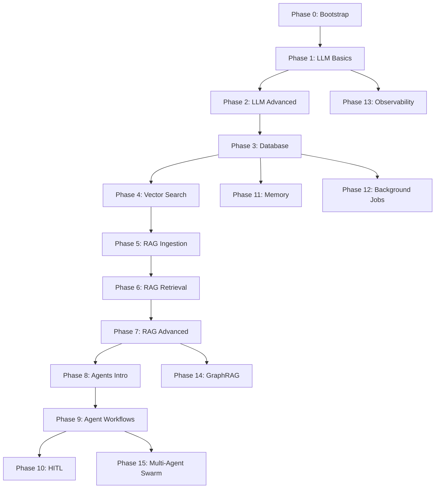

# InsightOS Implementation Phases

A progressive, 16-phase implementation plan for building a production-grade AI-powered strategic market intelligence platform.

---

## 📋 Quick Reference

| Phase                                  | Title               | Key Features                    | Est. Time |
| -------------------------------------- | ------------------- | ------------------------------- | --------- |
| [0](./PHASE_00_MONOREPO_BOOTSTRAP.md)  | Monorepo Bootstrap  | TurboRepo, Hono, TanStack Start | 2-3 hrs   |
| [1](./PHASE_01_LLM_BASICS.md)          | LLM Basics          | Vercel AI SDK, streaming chat   | 2-3 hrs   |
| [2](./PHASE_02_LLM_ADVANCED.md)        | LLM Advanced        | Prompts, router, JSON mode      | 3-4 hrs   |
| [3](./PHASE_03_DATABASE_FOUNDATION.md) | Database Foundation | PostgreSQL, Drizzle, Redis      | 2-3 hrs   |
| [4](./PHASE_04_VECTOR_SEARCH.md)       | Vector Search       | pgvector, embeddings            | 2-3 hrs   |
| [5](./PHASE_05_RAG_INGESTION.md)       | RAG Ingestion       | Chunking, document processing   | 3-4 hrs   |
| [6](./PHASE_06_RAG_RETRIEVAL.md)       | RAG Retrieval       | Hybrid search, semantic cache   | 3-4 hrs   |
| [7](./PHASE_07_RAG_ADVANCED.md)        | RAG Advanced        | Reranking, query reformulation  | 3-4 hrs   |
| [8](./PHASE_08_AGENTS_INTRO.md)        | Agents Intro        | LangGraph, tools                | 3-4 hrs   |
| [9](./PHASE_09_AGENT_WORKFLOWS.md)     | Agent Workflows     | Plan→Act→Reflect cycles         | 4-5 hrs   |
| [10](./PHASE_10_HUMAN_IN_THE_LOOP.md)  | Human-in-the-Loop   | Approvals, checkpoints          | 3-4 hrs   |
| [11](./PHASE_11_MEMORY_SYSTEM.md)      | Memory System       | Multi-tier memory               | 4-5 hrs   |
| [12](./PHASE_12_BACKGROUND_JOBS.md)    | Background Jobs     | BullMQ queues                   | 2-3 hrs   |
| [13](./PHASE_13_OBSERVABILITY.md)      | Observability       | Langfuse tracing                | 2-3 hrs   |
| [14](./PHASE_14_GRAPHRAG.md)           | GraphRAG            | Neo4j knowledge graphs          | 4-5 hrs   |
| [15](./PHASE_15_MULTI_AGENT_SWARM.md)  | Multi-Agent Swarm   | Agent handoffs, orchestration   | 4-5 hrs   |

**Total Estimated Time:** ~50-60 hours

---

## 🏗️ Architecture Overview

```
┌──────────────────────────────────────────────────────────────────┐
│                        InsightOS Architecture                     │
├──────────────────────────────────────────────────────────────────┤
│  Frontend (TanStack Start)                                        │
│  ├── Chat Interface                                               │
│  ├── Document Upload                                              │
│  └── Analysis Dashboard                                           │
├──────────────────────────────────────────────────────────────────┤
│  API Layer (Hono)                                                 │
│  ├── /chat          → Streaming LLM responses                     │
│  ├── /analyze       → Structured analysis                         │
│  ├── /documents     → Document management                         │
│  ├── /rag           → RAG queries                                 │
│  ├── /agents        → Agent workflows                             │
│  ├── /memory        → Memory management                           │
│  └── /graph         → Knowledge graph                             │
├──────────────────────────────────────────────────────────────────┤
│  Core Services                                                    │
│  ├── LLM Engine (Vercel AI SDK + LangGraph)                       │
│  ├── RAG Pipeline (Hybrid Search + Reranking)                     │
│  ├── Agent Orchestrator (Swarm + HITL)                            │
│  └── Memory Manager (Buffer + Session + Long-term)                │
├──────────────────────────────────────────────────────────────────┤
│  Data Layer                                                       │
│  ├── PostgreSQL + pgvector (Documents, Embeddings)                │
│  ├── Redis (Cache, Sessions, Queues)                              │
│  └── Neo4j (Knowledge Graph)                                      │
├──────────────────────────────────────────────────────────────────┤
│  Infrastructure                                                   │
│  ├── BullMQ (Background Jobs)                                     │
│  └── Langfuse (Observability)                                     │
└──────────────────────────────────────────────────────────────────┘
```

---

## 🛠️ Tech Stack Summary

| Category            | Technology           | Phase Introduced |
| ------------------- | -------------------- | ---------------- |
| **Monorepo**        | TurboRepo + pnpm     | Phase 0          |
| **Backend**         | Hono                 | Phase 0          |
| **Frontend**        | TanStack Start       | Phase 0          |
| **LLM SDK**         | Vercel AI SDK        | Phase 1          |
| **Agent Framework** | LangGraph.js         | Phase 8          |
| **Database**        | PostgreSQL + Drizzle | Phase 3          |
| **Vector DB**       | pgvector             | Phase 4          |
| **Cache**           | Redis                | Phase 3          |
| **Queue**           | BullMQ               | Phase 12         |
| **Graph DB**        | Neo4j                | Phase 14         |
| **Observability**   | Langfuse             | Phase 13         |
| **UI Components**   | shadcn/ui            | (Future)         |

---

## 📦 Package Structure

```
/insight-os-monorepo
├── apps/
│   ├── api/              # Hono API server
│   ├── web/              # TanStack Start frontend
│   └── worker/           # BullMQ workers
│
├── packages/
│   ├── shared/           # Shared types & utilities
│   ├── db-schema/        # Drizzle schema & migrations
│   ├── ai-engine/        # LangGraph agents & tools
│   ├── memory/           # Multi-tier memory system
│   ├── jobs/             # BullMQ queues & workers
│   └── graph/            # Neo4j client & utilities
│
└── docs/
    └── phases/           # Implementation guides
```

---

## 🚀 Getting Started

### Prerequisites

- Node.js v22+
- pnpm v9+
- PostgreSQL 15+ with pgvector
- Redis 7+
- Neo4j 5+ (Phase 14+)

### Quick Start

```bash
# Clone and install
git clone <repo>
cd insight-os-monorepo
pnpm install

# Set up environment
cp .env.example .env
# Edit .env with your API keys

# Start development
pnpm dev
```

---

## 📊 Phase Dependencies



---

## 🎯 Milestone Checkpoints

### Milestone 1: Foundation (Phases 0-3)

**Deliverable:** Working API + Frontend with database

- [ ] API health endpoint
- [ ] Frontend displays API status
- [ ] Database connections work
- [ ] Basic CRUD operations

### Milestone 2: RAG System (Phases 4-7)

**Deliverable:** Document ingestion and intelligent search

- [ ] Upload and chunk documents
- [ ] Vector + keyword search
- [ ] Semantic caching works
- [ ] Reranking improves results

### Milestone 3: Agent System (Phases 8-10)

**Deliverable:** Autonomous agents with human oversight

- [ ] Basic agent completes tasks
- [ ] Plan→Act→Reflect cycle works
- [ ] Human approval gates function
- [ ] Checkpoints enable resume

### Milestone 4: Production Ready (Phases 11-15)

**Deliverable:** Full-featured intelligent platform

- [ ] Memory persists across sessions
- [ ] Background jobs process async
- [ ] Tracing captures all operations
- [ ] Knowledge graph enhances RAG
- [ ] Multi-agent swarm collaborates

---

## 💡 Tips for Success

1. **Follow phases sequentially** - Each phase builds on previous work
2. **Test each phase** - Use the demo checklist before moving on
3. **Keep env vars updated** - Add new keys as required
4. **Run migrations** - After schema changes in Phase 3+
5. **Monitor Langfuse** - Debugging agents is easier with traces

---

## 📚 Additional Resources

- [Vercel AI SDK Docs](https://sdk.vercel.ai/docs)
- [LangGraph.js Docs](https://langchain-ai.github.io/langgraphjs/)
- [Drizzle ORM Docs](https://orm.drizzle.team/)
- [Hono Docs](https://hono.dev/)
- [TanStack Start Docs](https://tanstack.com/start)
- [Langfuse Docs](https://langfuse.com/docs)

---

## ❓ Need Help?

Each phase document includes:

- Step-by-step implementation
- Code examples
- Demo checklist
- API testing commands
- Troubleshooting tips

Start with **Phase 0** and work through sequentially for best results.
